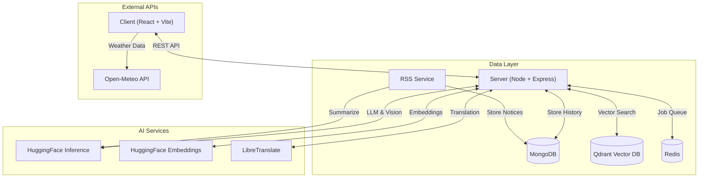
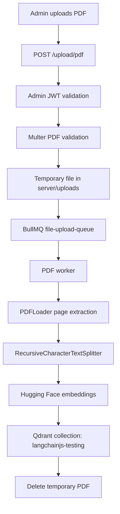
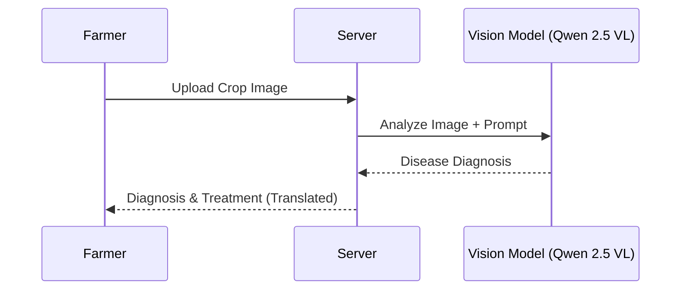

# AgroSathi

AgroSathi is an agriculture intelligence platform that combines a React chat interface, an Express API, a Retrieval-Augmented Generation (RAG) pipeline, image-based crop diagnosis, weather lookup, and agricultural notices. The repository is organized as three runnable services:

- `client/`: React + Vite single-page application.
- `server/`: Express API, MongoDB models, RAG orchestration, disease diagnosis, PDF upload, and BullMQ worker.
- `rss-service/`: Scheduled RSS ingestion service for agricultural news and government schemes.

The implementation uses MongoDB for user and application data, Qdrant for vector retrieval, Valkey/Redis for PDF ingestion jobs, Hugging Face for text generation and embeddings, Google Gemini for image diagnosis, LibreTranslate for translation support, and Open-Meteo for browser-side weather data.

## Implemented Features

### 🤖 **Intelligent Agricultural Assistant (RAG)**
-   **Document Grounding**: Ingests agricultural PDFs to provide answers strictly based on authoritative sources, reducing hallucinations.
-   **Semantic Search**: Uses **Qdrant** and **HuggingFace** embeddings to find the most relevant context for every query.
-   **Multi-Turn Conversations**: Remembers context from previous messages to handle follow-up questions naturally.
-   **Query Rewriting**: Automatically refines vague follow-up questions into standalone queries for better retrieval.

### 🍃 **Pest & Disease Detection**
-   **Visual Diagnosis**: Farmers can upload photos of crops to instantly identify diseases.
-   **AI Analysis**: Powered by **Qwen 2.5 VL** (Vision-Language Model), it detects issues with high accuracy.
-   **Actionable Advice**: Provides detailed severity assessments, treatment recommendations, and prevention measures.
-   **Multilingual Output**: Disease reports are automatically translated into the user's preferred language.

### 🌐 **Multilingual Support**
-   **Real-Time Translation**: Seamlessly translates queries and responses between English and Indian languages using **LibreTranslate**.
-   **Supported Languages**: Hindi, Bengali, Tamil, Telugu, Marathi, Kannada, Malayalam, Gujarati, Punjabi, and Urdu.
-   **Voice Input**: Supports speech-to-text for accessible interaction in native languages with visual waveform feedback.

### 🌤️ **Real-Time Weather Integration**
-   **Location-Based Forecast**: Displays current temperature, humidity, wind speed, and rain probability using **Open-Meteo API**.
-   **7-Day Forecast**: Provides detailed daily weather predictions to help farmers plan agricultural activities.
-   **Premium UI**: Features glassmorphism design with smooth animations and dark mode support.

### 📰 **Agricultural News & Schemes**
-   **RSS Feed Aggregation**: Automatically fetches and summarizes government schemes and agricultural news.
-   **AI-Powered Summaries**: Uses LLM to generate concise, farmer-friendly summaries of complex notices.
-   **Scheduled Updates**: Uses `node-cron` scheduler to run every 12 hours with graceful shutdown support.

### 🔐 **Secure & Robust Architecture**
-   **Authentication**: Secure JWT-based login for Users and Admins.
-   **Chat Management**:
    -   Persistent chat history stored in **MongoDB**.
    -   Separate history tracking for General Chat and Disease Detection.
    -   Ability to rename and delete conversations.
-   **Admin Dashboard**: Secure capabilities for authorized personnel to upload and manage reference documents (PDFs).

---

## 🧩 Architecture & Workflows

### System Architecture



## RAG Workflow

### PDF Ingestion



### Chat Response Generation



---

---

## 📂 Project Structure

### Backend (`server/`)
-   **`config/`**: Database, AI, and Queue configuration.
-   **`controllers/`**: Request handling logic (`chatController`, `diseaseController`, `noticeController`, etc.).
-   **`routes/`**: API route definitions mapping to controllers.
-   **`services/`**: Business logic helpers (`aiService`, `visionService`, `translationService`).
-   **`utils/`**: Shared utilities (`response` helpers, `multer` config).
-   **`middleware/`**: Authentication and authorization middleware.

### Frontend (`client/`)
-   **`src/components/`**: Reusable UI components (`Sidebar`, `WeatherWidget`, `NoticesWidget`).
-   **`src/pages/`**: Main application views (`Chatbot.jsx`, `Login.jsx`, `AdminUpload.jsx`).
-   **`src/utils/`**: Client-side utilities (API helpers, auth, text-to-speech).

### RSS Service (`rss-service/`)
-   **`jobs/`**: Scheduled RSS feed processing logic.
-   **`services/`**: RSS parsing and AI summarization services.
-   **`config/`**: Database connection for storing notices.

---

## 🏗️ Tech Stack

### **Frontend**
-   **Framework**: [React](https://react.dev/) (Vite)
-   **Styling**: [Tailwind CSS](https://tailwindcss.com/)
-   **Animations**: [Framer Motion](https://www.framer.com/motion/)
-   **Icons**: [Lucide React](https://lucide.dev/)
-   **State & Routing**: React Router DOM

### **Backend**
-   **Runtime**: [Node.js](https://nodejs.org/)
-   **Framework**: [Express.js](https://expressjs.com/)
-   **Database**: [MongoDB](https://www.mongodb.com/) (Mongoose)
-   **Vector Database**: [Qdrant](https://qdrant.tech/)
-   **Queue System**: [BullMQ](https://docs.bullmq.io/) with [Redis](https://redis.io/)
-   **AI Framework**: [LangChain](https://js.langchain.com/)
-   **RSS Parsing**: [rss-parser](https://www.npmjs.com/package/rss-parser)

### **AI & Models**
-   **Chat LLM**: **Qwen 2.5 72B Instruct** (via [HuggingFace Inference](https://huggingface.co/))
-   **Vision Model**: **Qwen 2.5 VL 7B Instruct** (via HuggingFace Inference)
-   **Query Rewriter**: **Meta-Llama 3.1 8B Instruct** (via HuggingFace Inference)
-   **Embeddings**: `sentence-transformers/all-MiniLM-L6-v2`
-   **Translation**: [LibreTranslate](https://libretranslate.com/)

---

## 🐳 Running the Project with Docker

### Prerequisites
-   [Docker & Docker Compose](https://www.docker.com/)

### Quick Start

1. **Clone the repository**:
```bash
git clone <repository-url>
cd agricultural-chat-bot
```

2. **Configure environment variables**:
Create a `.env` file in the `server` directory:
```env
PORT=8000
MONGODB_URI=your_mongodb_connection_string
JWT_SECRET=your_user_jwt_secret
ADMIN_USERNAME=admin
ADMIN_PASSWORD=your_admin_password
ADMIN_JWT_SECRET=your_admin_jwt_secret
HUGGINGFACE_API_KEY=your_huggingface_api_key
GEMINI_API_KEY=your_gemini_api_key
QDRANT_URL=http://qdrant:6333
REDIS_HOST=valkey
REDIS_PORT=6379

# AI Services
HUGGINGFACE_API_KEY=your_hf_key_here
LIBRETRANSLATE_URL=http://libretranslate:5000
```

Create `client/.env`:

```env
VITE_API_BASE=http://localhost:8000
```

Create `rss-service/.env`:

```env
MONGODB_URI=your_mongodb_connection_string
```

## Running with Docker Compose

Prerequisites:

- Docker
- Docker Compose
- A reachable MongoDB instance configured through `MONGODB_URI`

Start all services:

```bash
docker-compose up --build
```

Default service URLs:

| Service | URL |
| --- | --- |
| Client | `http://localhost:5173` |
| Backend API | `http://localhost:8000` |
| Qdrant | `http://localhost:6333` |
| Valkey/Redis | `localhost:6379` |
| LibreTranslate | `http://localhost:5000` |

Important: `docker-compose.yml` does not define a MongoDB container. Use a local, remote, or managed MongoDB deployment and set `MONGODB_URI` accordingly.

## Local Development

Install and run each service separately if you do not want to use Docker.

Backend:

```bash
cd server
pnpm install
pnpm dev
```

PDF worker:

```bash
docker-compose down
```

---

## 📚 API Endpoints

### Authentication
- `POST /auth/signup` - User registration
- `POST /auth/login` - User login
- `POST /admin/login` - Admin login

### Chat
- `POST /chat/create` - Create new chat session
- `GET /chat/list` - Get all chat sessions
- `GET /chat/history/:chatId` - Get chat history
- `POST /chat` - Send message (RAG-based response)
- `DELETE /chat/:chatId` - Delete chat session

### Disease Detection
- `POST /chat/disease/create` - Create disease detection session
- `POST /chat/disease-detect` - Upload image for diagnosis
- `GET /chat/disease/history/:chatId` - Get diagnosis history

### Admin
- `POST /upload/pdf` - Upload agricultural reference documents

### Notices
- `GET /api/notices` - Get paginated agricultural news and schemes
  - Query params: `page`, `limit`, `type` (GOVERNMENT | AGRI_NEWS)

---

## � Production Deployment

### Environment Configuration
Ensure all environment variables are properly set:
- `HUGGINGFACE_API_KEY` - Required for AI models
- `JWT_SECRET` & `ADMIN_JWT_SECRET` - Use strong, unique secrets
- `MONGODB_URI` - Production MongoDB connection string
- `QDRANT_URL` - Qdrant vector database URL
- `REDIS_HOST` & `REDIS_PORT` - Redis/Valkey configuration

### Build Steps
```bash
cd client
npm install
npm run dev
```

RSS service:

```bash
docker-compose -f docker-compose.yml up -d --build
```

### Health Checks
- Backend: `GET http://localhost:8000/` should return `{"status":"OK"}`
- Qdrant: `http://localhost:6333/dashboard`
- Redis: Use `redis-cli ping`

---

## �🔑 Getting HuggingFace API Key

1. Create a free account at [HuggingFace](https://huggingface.co/)
2. Go to [Settings > Access Tokens](https://huggingface.co/settings/tokens)
3. Create a new token with "Read" permissions
4. Copy the token and add it to your `.env` file

---

## 🤝 Contributing

Contributions are welcome! Please feel free to submit a Pull Request.

---

## 📄 License

This project is open-source and available under the MIT License.

---

## 🙏 Acknowledgments

- **HuggingFace** for providing free inference API
- **Qwen Team** for the excellent Qwen 2.5 models
- **Meta** for Llama 3.1 models
- **LibreTranslate** for open-source translation